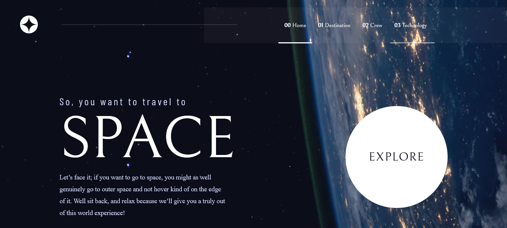
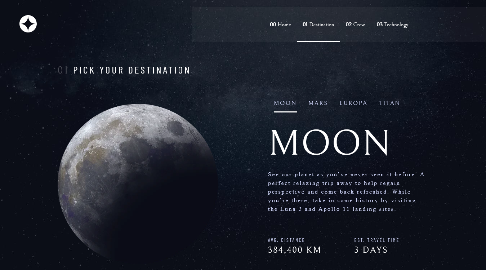

# Frontend Mentor - Space tourism website solution

This is a solution to the [Space tourism website challenge on Frontend Mentor](https://www.frontendmentor.io/challenges/space-tourism-multipage-website-gRWj1URZ3). Frontend Mentor challenges help you improve your coding skills by building realistic projects.

## Table of contents

- [Overview](#overview)
  - [The challenge](#the-challenge)
  - [Screenshot](#screenshot)
  - [Links](#links)
- [My process](#my-process)
  - [Built with](#built-with)
  - [Continued development](#continued-development)
  - [Useful resources](#useful-resources)
- [Author](#author)

## Overview

### The challenge

Users should be able to:

- View the optimal layout for each of the website's pages depending on their device's screen size
- See hover states for all interactive elements on the page
- View each page and be able to toggle between the tabs to see new information

### Screenshot

#### (Home Page)

#### (Destination Page)

### Links

- Solution URL: [solution URL](https://github.com/guilhermesc-6/space-tourism-website)
- Live Site URL: [live site URL](https://guilherme-space-website.netlify.app/)

## My process

### Built with

- React
- SASS / SCSS
- React-Router

### Useful resources

- [React Router](https://reactrouter.com/) - This helped me for XYZ reason. I really liked this pattern and will use it going forward.
- [Example resource 2](https://www.example.com) - This is an amazing article which helped me finally understand XYZ. I'd recommend it to anyone still learning this concept.

## Author

- Github - [Github - Guilherme](https://github.com/guilhermesc-6/)
- Frontend Mentor - [@guilhermesc-6](https://www.frontendmentor.io/profile/guilhermesc-6)
